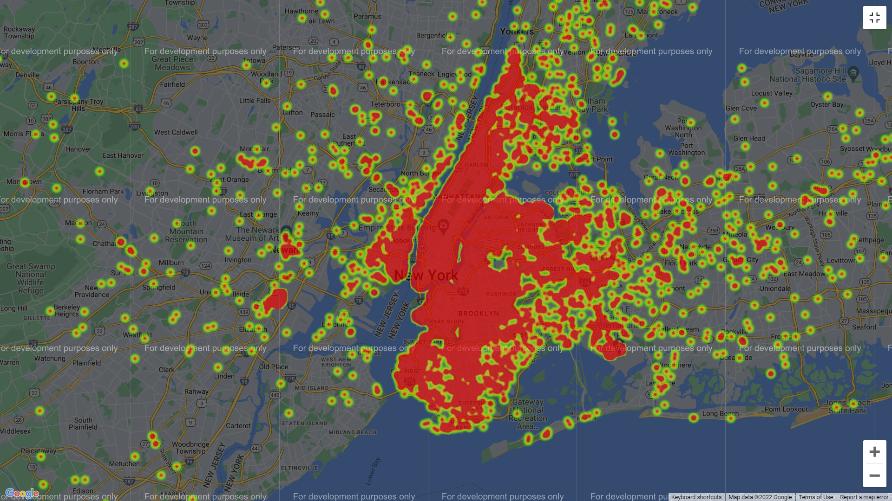

# UBER DATA ANALYSIS by TeamOverFlow

### This project aims to:

- Visualize **Uber's ridership growth** in NYC in 2014 and 2018.
- Visualize **pickup coordinates** in a real-time map.
- Characterize the **demand based on the identified data from the dataset**.
- **Estimate the predicted fare** using the extracted features from the dataset using two ML Models.
- Compare **UBER** and **LYFT** on the basis of the number of service cars available and the number of customers in each service.

**REQUIREMENTS:**
The code is written in a Jupyter Notebook with a Python 3.9  kernel and in addition, it requires the following packages:

- [Pandas](http://pandas.pydata.org/)
- [Matplotlib](http://matplotlib.org/)
- [Seaborn](http://seaborn.pydata.org/)
- [Scikit-Learn](https://scikit-learn.org/)
- [Numpy](https://numpy.org/)
- [Google Apps API](https://developers.google.com/apis-explorer)

**SNIPPETS FROM THE NOTEBOOK:**

<b>
 PICKUP LOCATIONS</b> of UBER CUSTOMERS

<b>
 Heat Map</b> of UBER RIDES 

